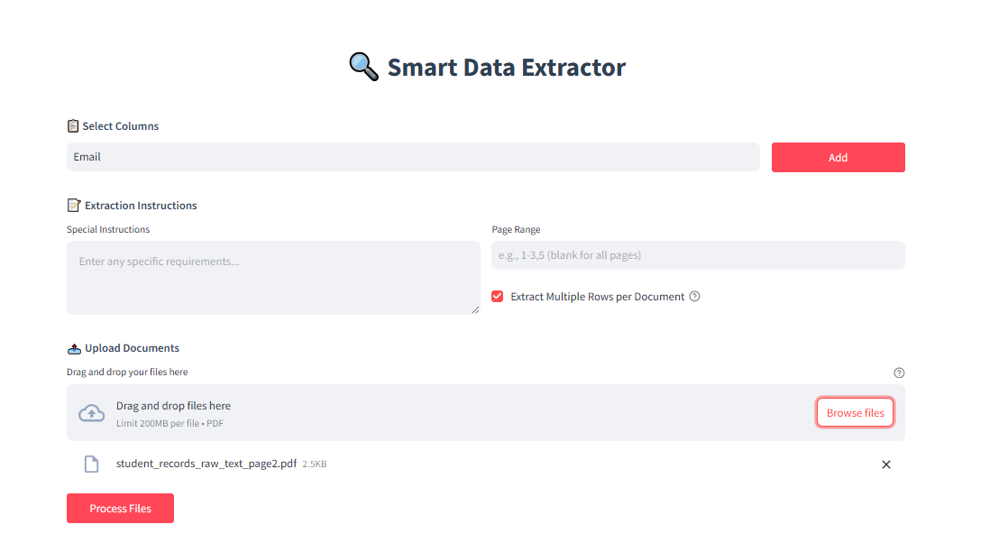

# 🔍 Smart Data Extractor (PDF to CSV)

A Streamlit web application that extracts structured data from PDF documents using OpenAI's GPT model. This tool is especially useful for converting unstructured legal or tabular PDF text into clean, usable CSV data by specifying column names and custom extraction instructions.

---
[](demo.webm)

---

## 🚀 Features

* 📄 **PDF Upload**: Drag-and-drop support for one or multiple PDF files.
* 📑 **Page Range Selection**: Process specific pages only.
* 🧠 **OpenAI Integration**: Uses GPT-4o-mini for context-aware data extraction.
* 🧾 **Custom Columns**: Add and manage expected output fields.
* ✍️ **Flexible Instructions**: Fine-tune extraction logic via user-defined instructions.
* 📤 **CSV Export**: Download extracted data as a CSV file.
* 🧠 **Token-aware Chunking**: Ensures large PDFs are processed safely within token limits.
* 🎨 **Modern UI**: Responsive and styled with custom CSS for a sleek experience.

---

## 🧰 Technologies Used

* [Streamlit](https://streamlit.io/)
* [pdfplumber](https://github.com/jsvine/pdfplumber)
* [OpenAI Python SDK](https://pypi.org/project/openai/)
* [tiktoken](https://github.com/openai/tiktoken)
* [pandas](https://pandas.pydata.org/)
* Regular Expressions, JSON, Error Handling

---

## ⚙️ Installation

```bash
# Clone this repository
git clone https://github.com/your-username/smart-data-extractor.git
cd smart-data-extractor

# Create and activate virtual environment (optional but recommended)
python -m venv venv
source venv/bin/activate  # On Windows: venv\Scripts\activate

# Install dependencies
pip install -r requirements.txt
```

---

## 📦 Required Packages (`requirements.txt`)

```txt
streamlit
pandas
pdfplumber
openai
tiktoken
```

---

## ▶️ Usage

```bash
streamlit run app.py
```

Then open your browser at `http://localhost:8501`.

---

## 📝 How to Use

1. **Enter OpenAI API Key** in the sidebar.
2. **Add column names** representing the structured fields you want to extract.
3. **Enter extraction instructions** (e.g., “extract only cases with judgment date”).
4. **Upload PDF documents** (single or multiple).
5. **Specify page range** if needed (e.g., `1-3,5`).
6. **Click 'Process Files'** to extract structured data.
7. **Preview results** and **download as CSV**.

---

## ✅ Example

### 📥 Input

* PDF file with legal case listings
* Columns: `["case_number", "petitioner", "respondent", "date"]`
* Instructions: `"Extract data only from civil cases"`

### 📤 Output

```json
[
  {
    "case_number": "CIV-2024-1532",
    "petitioner": "John Doe",
    "respondent": "Jane Smith",
    "date": "2024-09-12",
    "source_file": "cases.pdf"
  }
]
```

---

## ⚠️ Error Handling

* **Invalid Page Range**: Notifies users to correct format.
* **Missing API Key**: Prompts user to input key.
* **OpenAI Failures**: Handles API errors, rate limits, and decoding issues gracefully.
* **File Type Check**: Only PDFs are supported currently.

---

## 📌 Notes

* Make sure your OpenAI key has access to GPT-4o-mini or a model with large token limits.
* Token limit for prompt + response is capped to 128,000 tokens, with \~2,000 reserved for output.

---

## 👤 Author

**Asad Khan**
[GitHub](https://github.com/assad-khan) | [Fiverr](https://www.fiverr.com/s/dDB9epg) | [LinkedIn](https://linkedin.com)

---

## 📜 License

```
© 2025 Asad Khan. All rights reserved.

This project is not open for commercial use or redistribution without explicit permission from the author.

If you wish to use, modify, or distribute this software, please contact:

📧 asadpythondeveloper@gmail.com
```
